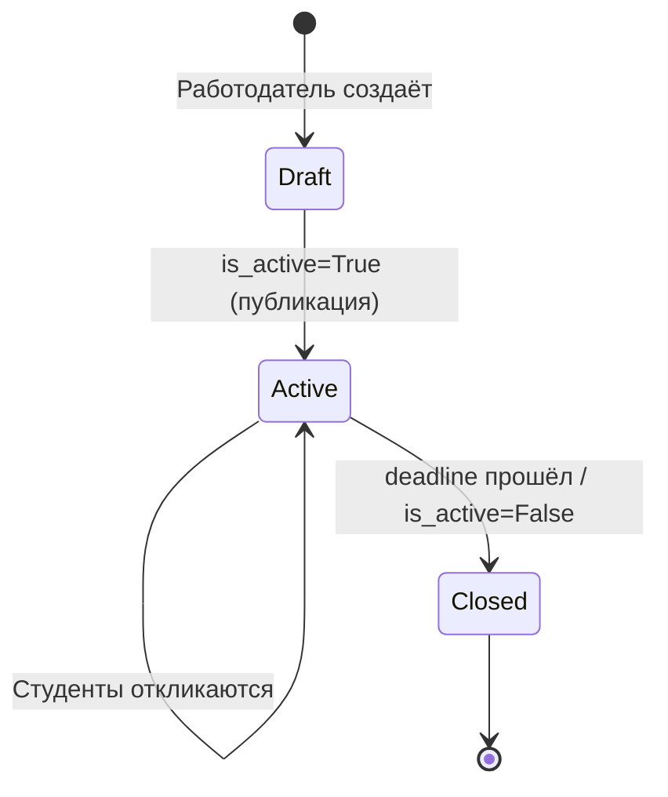
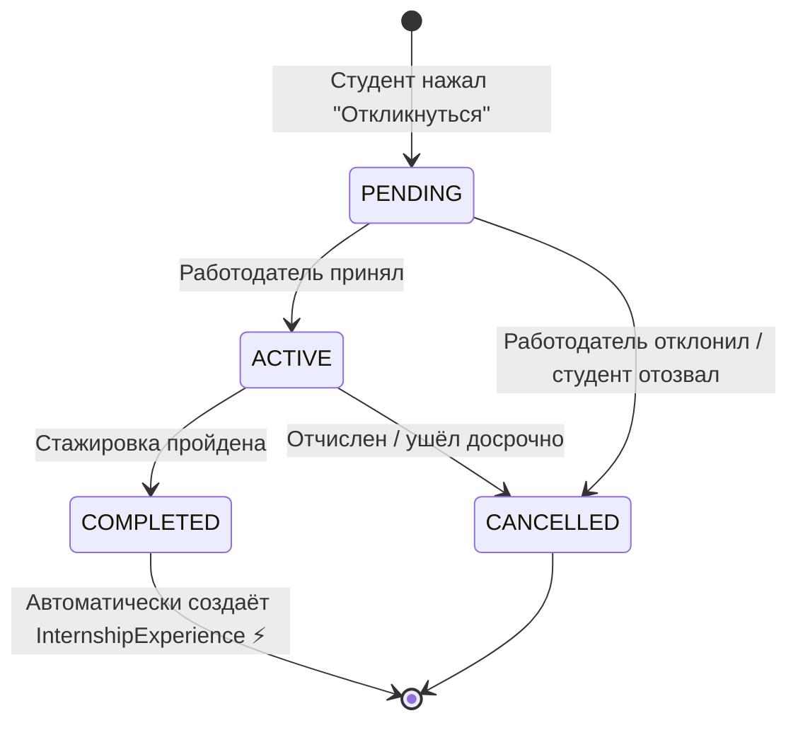

# Бизнес-логика StudCareer

## 1. Роли пользователей (RBAC)

| Роль | `User.role` | Связанный профиль | Что может | Что НЕ может |
|---|---|---|---|---|
| **Студент** | `student` | `StudentProfile` (1:1) | Искать стажировки, откликаться, проходить, иметь резюме | Создавать стажировки, управлять кандидатами |
| **Работодатель** | `employer` | `Company` (1:1) | Создавать стажировки, менять статус откликов, смотреть профили | Откликаться на стажировки |
| **Администратор** | `admin` | _(нет)_ | Модерировать, верифицировать компании, банить пользователей | _(полный доступ через Django Admin)_ |

> ⚠️ Роль задаётся при регистрации и **не меняется** пользователем.

---

## 2. Матрица разграничения доступа

| Действие | Анон | Студент | Работодатель | Админ |
|---|---|---|---|---|
| Просмотр каталога стажировок | ✅ | ✅ | ✅ | ✅ |
| Просмотр страницы стажировки | ✅ | ✅ | ✅ | ✅ |
| Отклик на стажировку | ❌ | ✅ | ❌ | ❌ |
| Создание стажировки | ❌ | ❌ | ✅ | ✅ |
| Редактирование стажировки | ❌ | ❌ | ✅ (своей) | ✅ |
| Kanban-доска кандидатов | ❌ | ❌ | ✅ (своих) | ✅ |
| Изменение статуса кандидата | ❌ | ❌ | ✅ (своих) | ✅ |
| Конструктор резюме | ❌ | ✅ | ❌ | ❌ |
| Просмотр резюме | ✅ | ✅ | ✅ | ✅ |
| Экспорт резюме (PDF/DOCX) | ✅ | ✅ | ✅ | ✅ |
| Редактирование профиля компании | ❌ | ❌ | ✅ (своей) | ✅ |
| Django Admin | ❌ | ❌ | ❌ | ✅ |

**Декораторы для проверки ролей** реализованы в:
- `apps/accounts/decorators.py` — `@student_required`, `@employer_required`
- `apps/accounts/mixins.py` — `StudentRequiredMixin`, `EmployerRequiredMixin`

---

## 3. Жизненный цикл Стажировки



1. Работодатель создает стажировку (`Internship`), она может быть сразу `is_active=True`.
2. Студенты видят стажировку в каталоге и могут откликнуться.
3. По дедлайну (или вручную) работодатель закрывает приём откликов (`is_active=False`).

---

## 4. Жизненный цикл Отклика (InternshipParticipant)



### Статусы `InternshipParticipant.status`:
| Статус | Значение | Кто меняет |
|---|---|---|
| `pending` | Студент подал отклик, ждёт решения | Автоматически при отклике |
| `active` | Работодатель принял, стажировка идёт | Работодатель (Kanban) |
| `completed` | Стажировка успешно завершена | Работодатель (Kanban) |
| `cancelled` | Отменена (отказ/отчисление/уход) | Работодатель или студент |

### ⚡ Критическая автоматизация: `COMPLETED` → `InternshipExperience`
При переходе в `completed` система **АВТОМАТИЧЕСКИ** создаёт объект `InternshipExperience` и привязывает его к `StudentProfile` студента.

```python
# Реализовать через сигнал post_save или сервис-функцию:
@receiver(post_save, sender=InternshipParticipant)
def create_experience_on_completion(sender, instance, **kwargs):
    if instance.status == 'completed':
        InternshipExperience.objects.get_or_create(
            profile=instance.student.student_profile,
            internship=instance.internship,
            defaults={
                'company_name': instance.internship.company.name,
                'position': instance.position or instance.internship.title,
                'start_date': instance.start_date,
                'end_date': instance.end_date,
            }
        )
```

> ⚠️ **НЕ создавай InternshipExperience вручную!** Только через этот автоматический процесс. Иначе будут дубли в резюме.

---

## 5. Формирование резюме

Резюме студента — это **агрегация** данных из нескольких моделей:

```
StudentProfile (основное)
├── Skill[] (навыки, уровень 1-5)
├── LanguageSkill[] (языки, уровень A1-Native)
└── InternshipExperience[] (опыт стажировок — заполняется АВТОМАТИЧЕСКИ)
```

### Экспорт:
- **PDF** — через WeasyPrint: рендерит HTML-шаблон (тема: `profiles/themes/classic.html`) в PDF.
- **DOCX** — через python-docx: программная сборка документа.

Оба сервиса находятся в `apps/profiles/services/`.

---

## 6. Верификация компаний

| Статус | `Company.verification_status` | Значение |
|---|---|---|
| `pending` | Компания только зарегистрировалась, ждёт проверки | По умолчанию |
| `verified` | Проверена администратором | Может создавать стажировки |
| `rejected` | Отклонена (фейк/спам) | Не может создавать стажировки |

> 💡 В текущей реализации верификация через Django Admin. В будущем — автоматическая проверка + UI для админа.

---

## 7. Бизнес-правила (Quick Reference)

1. Студент может откликнуться на стажировку **только один раз** (`unique_together` на `InternshipParticipant`).
2. Только **verified** компании могут создавать стажировки (проверять в view).
3. Работодатель видит только **своих** кандидатов (object-level permission).
4. При `COMPLETED` → `InternshipExperience` создаётся **автоматически** (не вручную!).
5. Резюме студента **публичное** по умолчанию (`is_public=True`), но можно скрыть.
6. Для действий над стажировкой работодатель должен быть **владельцем** (`internship.company.user == request.user`).
