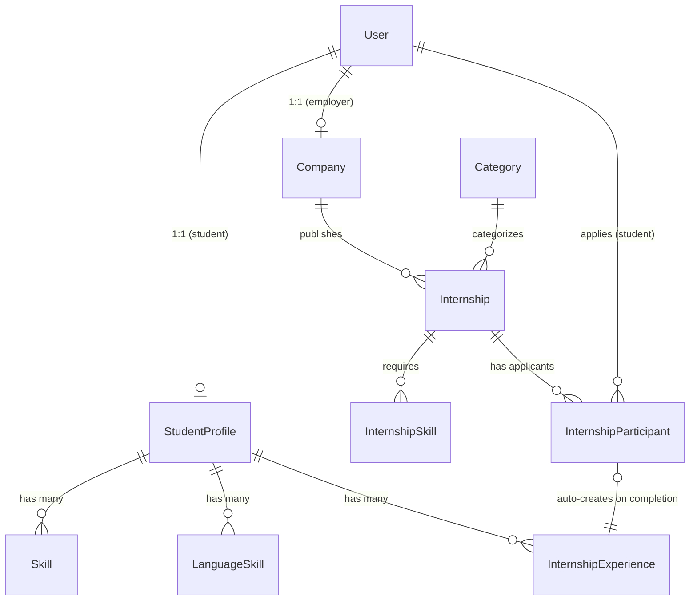

# Архитектура проекта StudCareer

## 1. Дерево файлов проекта

> ⚠️ **Обновляй это дерево** при создании новых приложений или значимых файлов.
> Последнее обновление: 2026-08-12 (после Фазы 2)

```
studcareer/                         ← корень проекта (= BASE_DIR)
├── manage.py
├── pyproject.toml                  ← Ruff, pytest
├── .pre-commit-config.yaml
├── db.sqlite3                      ← SQLite (dev only)
│
├── config/                         ← Django-проект
│   ├── __init__.py
│   ├── urls.py                     ← Главный роутер
│   ├── wsgi.py / asgi.py
│   └── settings/
│       ├── __init__.py             ← import development (по умолчанию)
│       ├── base.py                 ← Общие настройки
│       ├── development.py          ← DEBUG=True, SQLite
│       └── production.py           ← DEBUG=False, PostgreSQL, .env
│
├── apps/                           ← Все Django-приложения
│   ├── __init__.py
│   │
│   ├── accounts/                   ← Кастомная модель User
│   │   ├── models.py              ← User (AbstractUser + roles)
│   │   ├── views.py               ← login, register
│   │   ├── urls.py                ← /accounts/login/, /accounts/register/
│   │   └── admin.py
│   │
│   ├── core/                       ← Общие views (главная, legal)
│   │   ├── views.py               ← home
│   │   └── urls.py                ← / (главная)
│   │
│   ├── profiles/                   ← Профили студентов + резюме
│   │   ├── models.py              ← StudentProfile, Skill, LanguageSkill, InternshipExperience
│   │   ├── views.py               ← builder, viewer, export_pdf, export_docx
│   │   ├── urls.py                ← /profiles/builder/, /profiles/view/
│   │   ├── admin.py
│   │   └── services/
│   │       ├── pdf_exporter.py    ← WeasyPrint → PDF
│   │       └── docx_exporter.py   ← python-docx → DOCX
│   │
│   ├── companies/                  ← Профили компаний
│   │   ├── models.py              ← Company (1-to-1 User, verification_status)
│   │   ├── views.py               ← company_edit, company_view
│   │   ├── urls.py                ← /companies/edit/, /companies/<slug>/
│   │   └── admin.py
│   │
│   └── internships/                ← Стажировки (модели готовы, views — Фаза 3)
│       ├── models.py              ← Internship, Category, InternshipSkill, InternshipParticipant
│       ├── views.py               ← ⏳ пока пустой (Фаза 3)
│       └── admin.py
│
├── templates/                      ← Все HTML-шаблоны
│   ├── base.html                  ← Главный layout (Tailwind, Alpine, HTMX)
│   ├── home.html                  ← Лендинг
│   ├── components/
│   │   ├── navbar.html            ← Навигация (sticky)
│   │   ├── footer.html            ← Подвал
│   │   └── toast.html             ← Toast-уведомления (Alpine.js)
│   ├── accounts/
│   │   ├── login.html
│   │   └── register.html
│   ├── legal/
│   │   ├── terms_of_service.html
│   │   └── privacy_policy.html
│   ├── profiles/
│   │   ├── builder.html           ← Конструктор резюме
│   │   ├── viewer.html            ← Просмотр + кнопки экспорта
│   │   └── themes/
│   │       └── classic.html       ← Тема "Классика" (для viewer и PDF)
│   └── companies/
│       ├── edit.html              ← Форма редактирования
│       └── view.html              ← Публичная страница
│
├── requirements/
│   ├── base.txt                   ← Django, WeasyPrint, Celery, python-docx, Pillow
│   └── development.txt            ← pytest, ruff, pre-commit, django-debug-toolbar
│
├── locale/                         ← Переводы i18n (ru, uz, en)
│
└── .agents/                        ← База знаний агентов
    ├── AGENTS.md                  ← Главный файл правил
    ├── WORKLOG.md                 ← Журнал работы
    └── skills/                    ← 17 специализированных скиллов
```

---

## 2. Разделение настроек

Файлы настроек лежат в `config/settings/`:
- `base.py` — общие настройки (INSTALLED_APPS, middleware, i18n, AUTH_USER_MODEL).
- `development.py` — для локальной разработки (DEBUG=True, SQLite).
- `production.py` — для прода (DEBUG=False, PostgreSQL, SECRET_KEY из .env).

`__init__.py` по умолчанию импортирует `development`.

---

## 3. Приложения (Apps)

| Приложение | Путь | Назначение | Статус |
|---|---|---|---|
| `accounts` | `apps/accounts/` | Кастомный User с ролями (student, employer, admin). Авторизация по email | ✅ Готово |
| `core` | `apps/core/` | Главная страница, legal pages | ✅ Готово |
| `profiles` | `apps/profiles/` | Профили студентов, конструктор резюме, экспорт PDF/DOCX | ✅ Готово |
| `companies` | `apps/companies/` | Профили компаний, верификация (pending/verified/rejected) | ✅ Готово |
| `internships` | `apps/internships/` | Стажировки, категории, отклики. **Модели мигрированы, views пустые** | ⏳ Фаза 3 |

---

## 4. Связи между моделями (ER-диаграмма)



### Ключевые связи:
- `User (role=student)` → `StudentProfile` (OneToOne, `related_name='student_profile'`)
- `User (role=employer)` → `Company` (OneToOne, `related_name='company'`)
- `Company` → `Internship` (ForeignKey, `related_name='internships'`)
- `Internship` + `User (student)` → `InternshipParticipant` (unique_together)
- `InternshipParticipant (status=completed)` → **автоматически** создаёт `InternshipExperience`

---

## 5. Ключевые паттерны

| Паттерн | Описание |
|---|---|
| **Сервисный слой** | Бизнес-логика (экспорт PDF/DOCX) вынесена в `services/`, а не в views |
| **HTMX partial responses** | Views проверяют `HX-Request` и возвращают фрагмент или полную страницу |
| **Toast через Alpine.js** | POST-ответы триггерят `HX-Trigger: show-toast` → Alpine.js показывает уведомление |
| **Роли через TextChoices** | `User.Role.STUDENT`, `User.Role.EMPLOYER` — enum-подобные choices |
| **Авторизация по email** | `USERNAME_FIELD = 'email'`, не username |

---

## 6. Технологический стек

| Слой | Технология | Версия |
|---|---|---|
| Backend | Django | 5.2 |
| Database (dev) | SQLite | — |
| Database (prod) | PostgreSQL | — |
| Frontend CSS | Tailwind CSS | CDN |
| Frontend JS | Alpine.js + HTMX | CDN |
| Icons | Lucide (SVG) | CDN |
| PDF export | WeasyPrint | — |
| DOCX export | python-docx | — |
| Task queue | Celery + Redis | ⏳ Фаза 4 |
| Linting | Ruff | — |
| Testing | pytest + factory_boy | — |
