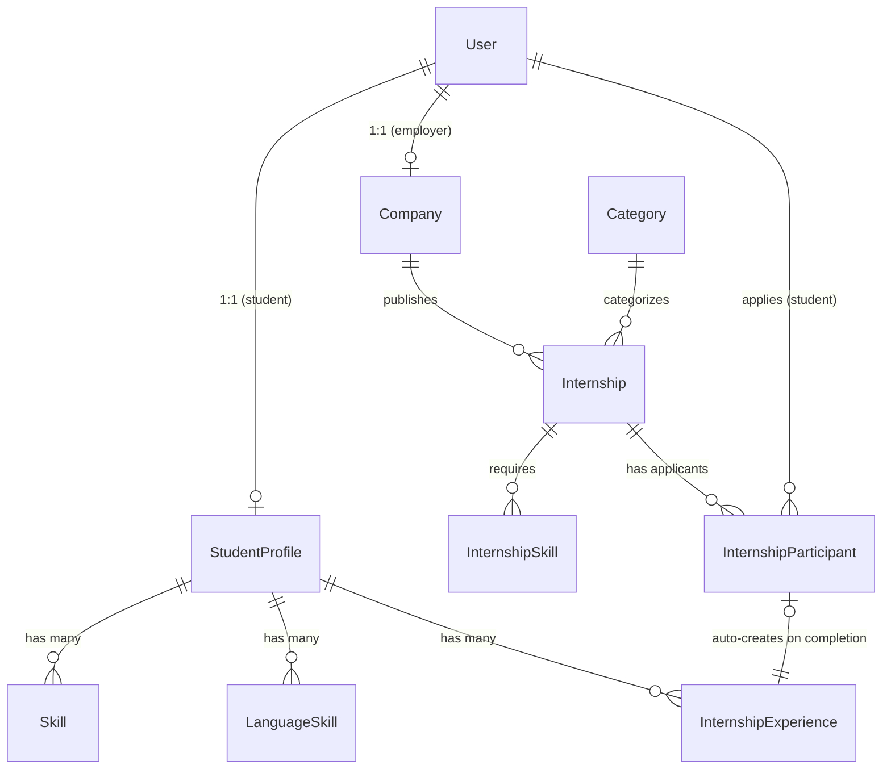

# Архитектура проекта StudCareer

## 1. Дерево файлов проекта

> ⚠️ **Обновляй это дерево** при создании новых приложений или значимых файлов.
> Последнее обновление: 2026-08-22 (Фаза 5 завершена)

```
studcareer/                         ← корень проекта (= BASE_DIR)
├── manage.py
├── pyproject.toml                  ← Ruff, pytest, per-file-ignores
├── .pre-commit-config.yaml
├── conftest.py                     ← фикстуры: student_user, employer_user, internship_factory,
│                                      CELERY_TASK_ALWAYS_EAGER (autouse)
├── scripts/
│   └── build_translations.py       ← сборка locale/{uz,en} через polib (gettext не нужен)
├── db.sqlite3                      ← SQLite (dev only)
│
├── config/                         ← Django-проект
│   ├── __init__.py                 ← импорт celery_app
│   ├── celery.py                   ← Celery-приложение
│   ├── urls.py                     ← Роутер (+ i18n/setlang, media в DEBUG)
│   ├── wsgi.py / asgi.py
│   └── settings/
│       ├── __init__.py
│       ├── base.py                 ← STATIC_ROOT, MEDIA_*, auth-редиректы, i18n context processor
│       ├── development.py          ← DEBUG=True, SQLite, CELERY_TASK_ALWAYS_EAGER
│       └── production.py           ← .env, PostgreSQL, HSTS/SSL-redirect, SMTP
│
├── apps/
│   ├── __init__.py
│   │
│   ├── accounts/                   ← User + аутентификация
│   │   ├── models.py              ← User (AbstractUser + роли, логин по email)
│   │   ├── signals.py             ← автосоздание StudentProfile студентам (gotchas #15)
│   │   ├── decorators.py          ← @student_required / @employer_required
│   │   ├── mixins.py              ← CBV-миксины ролей
│   │   ├── views.py               ← register/login/logout + PasswordReset views
│   │   ├── urls.py                ← /accounts/* (вкл. password-reset/*)
│   │   └── tests.py               ← роли, auth-флоу, password-reset, i18n
│   │
│   ├── core/                       ← Главная страница
│   │   ├── views.py               ← home
│   │   └── urls.py                ← /
│   │
│   ├── profiles/                   ← Профили студентов + резюме
│   │   ├── models.py              ← StudentProfile, Skill, LanguageSkill, InternshipExperience
│   │   ├── views.py               ← builder (get_or_create), viewer, export_pdf, export_docx
│   │   ├── urls.py                ← /profiles/*
│   │   └── services/
│   │       ├── pdf_exporter.py    ← WeasyPrint → PDF (импорт внутри функции — GTK на Windows)
│   │       └── docx_exporter.py   ← python-docx → DOCX
│   │
│   ├── companies/                  ← Профили компаний
│   │   ├── models.py              ← Company (1-to-1 User, verification_status)
│   │   ├── views.py               ← profile_edit (get_or_create), profile_view
│   │   └── urls.py                ← /companies/edit/, /companies/<pk>/
│   │
│   ├── internships/                ← Ядро: стажировки и отклики
│   │   ├── models.py              ← Category, Internship, InternshipSkill, InternshipParticipant
│   │   │                            (participant.conversation → диалог)
│   │   ├── forms.py               ← InternshipForm (create/edit, автослаг)
│   │   ├── views.py               ← catalog, detail, apply, create, edit, my_internships,
│   │   │                            dashboard, update_participant_status (ALLOWED_TRANSITIONS)
│   │   ├── signals.py             ← completed → InternshipExperience; отклик/статус → Notification
│   │   ├── urls.py                ← /internships/* (<slug>/edit/ ДО catch-all <slug>/)
│   │   └── tests.py + test_journey.py  ← юнит + интеграционный путь студента
│   │
│   ├── messaging/                  ← Чаты Conversation (student↔company) + Message
│   │   └── Conversation создаётся при отклике (internships.views.apply)
│   │
│   └── notifications/              ← In-app уведомления
│       ├── models.py              ← Notification (recipient, message, url, is_read)
│       ├── context_processors.py  ← unread_count для бейджа navbar
│       └── urls.py                ← /notifications/, mark-read/ (POST)
│
├── templates/                      ← Полное дерево → templates_structure skill
│
├── requirements/
│   ├── base.txt                   ← Django, WeasyPrint, Celery, python-docx, Pillow
│   └── development.txt            ← pytest, ruff, pre-commit, polib
│
├── locale/{uz,en}/LC_MESSAGES/     ← django.po/.mo (сборка: scripts/build_translations.py)
├── staticfiles/                    ← collectstatic (gitignored)
├── media/                          ← загрузки (gitignored)
│
└── .agents/                        ← База знаний агентов
    ├── AGENTS.md                  ← Главный файл правил
    ├── WORKLOG.md                 ← Журнал работы
    └── skills/                    ← 17 специализированных скиллов
```

---

## 2. Разделение настроек

Файлы настроек лежат в `config/settings/`:
- `base.py` — общие настройки (INSTALLED_APPS, middleware, i18n, AUTH_USER_MODEL).
- `development.py` — для локальной разработки (DEBUG=True, SQLite).
- `production.py` — для прода (DEBUG=False, PostgreSQL, SECRET_KEY из .env).

`__init__.py` по умолчанию импортирует `development`.

---

## 3. Приложения (Apps)

| Приложение | Путь | Назначение | Статус |
|---|---|---|---|
| `accounts` | `apps/accounts/` | Кастомный User с ролями (student, employer, admin). Авторизация по email | ✅ Готово |
| `core` | `apps/core/` | Главная страница, legal pages | ✅ Готово |
| `profiles` | `apps/profiles/` | Профили студентов, конструктор резюме, экспорт PDF/DOCX | ✅ Готово |
| `companies` | `apps/companies/` | Профили компаний, верификация (pending/verified/rejected) | ✅ Готово |
| `internships` | `apps/internships/` | Стажировки, категории, отклики. **Модели мигрированы, views пустые** | ⏳ Фаза 3 |

---

## 4. Связи между моделями (ER-диаграмма)



### Ключевые связи:
- `User (role=student)` → `StudentProfile` (OneToOne, `related_name='student_profile'`)
- `User (role=employer)` → `Company` (OneToOne, `related_name='company'`)
- `Company` → `Internship` (ForeignKey, `related_name='internships'`)
- `Internship` + `User (student)` → `InternshipParticipant` (unique_together)
- `InternshipParticipant (status=completed)` → **автоматически** создаёт `InternshipExperience`

---

## 5. Ключевые паттерны

| Паттерн | Описание |
|---|---|
| **Сервисный слой** | Бизнес-логика (экспорт PDF/DOCX) вынесена в `services/`, а не в views |
| **HTMX partial responses** | Views проверяют `HX-Request` и возвращают фрагмент или полную страницу |
| **Toast через Alpine.js** | POST-ответы триггерят `HX-Trigger: show-toast` → Alpine.js показывает уведомление |
| **Роли через TextChoices** | `User.Role.STUDENT`, `User.Role.EMPLOYER` — enum-подобные choices |
| **Авторизация по email** | `USERNAME_FIELD = 'email'`, не username |

---

## 6. Технологический стек

| Слой | Технология | Версия |
|---|---|---|
| Backend | Django | 5.2 |
| Database (dev) | SQLite | — |
| Database (prod) | PostgreSQL | — |
| Frontend CSS | Tailwind CSS | CDN |
| Frontend JS | Alpine.js + HTMX | CDN |
| Icons | Lucide (SVG) | CDN |
| PDF export | WeasyPrint | — |
| DOCX export | python-docx | — |
| Task queue | Celery + Redis | ⏳ Фаза 4 |
| Linting | Ruff | — |
| Testing | pytest + factory_boy | — |
