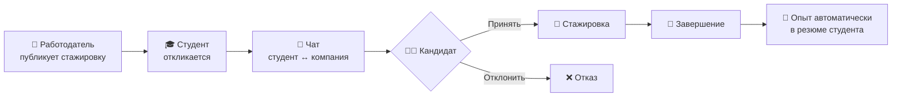

<div align="center">

# 🎓 StudCareer

**Трекер стажировок, а не доска вакансий.**

Студент проходит стажировку — она **автоматически** становится строкой в его резюме.
Работодатель получает проверенных кандидатов с реальным опытом.

[](https://python.org)
[](https://djangoproject.com)
[](https://docs.celeryq.dev)
[](https://htmx.org)
[](https://tailwindcss.com)
[](#-тестирование)
[](#-локализация)

</div>

---

## ✨ Что это

Классический job-борд отдаёт студенту без опыта строчку «требуется 3 года опыта».
**StudCareer** замыкает цикл: компания публикует стажировку → студент откликается →
работодатель ведёт кандидата по Kanban → по завершении стажировки опыт **сам**
появляется в резюме студента вместе с подтверждением от компании.



---

## 🚀 Возможности

### Для студентов

| | |
|---|---|
| 🔍 | Каталог с живым поиском (debounce 400 мс), фильтры: формат, категория, оплата |
| 📄 | Конструктор резюме + экспорт в **PDF** и **DOCX** одной кнопкой |
| 💬 | Встроенный чат с работодателем сразу после отклика |
| 🔔 | Уведомления о смене статуса отклика — колокольчик + email |
| 🏆 | Завершённая стажировка сама попадает в раздел «Опыт» |

### Для работодателей

| | |
|---|---|
| 📝 | Публикация и редактирование стажировок, закрытие набора в один клик |
| 📊 | Kanban-доска кандидатов: `Новые → В процессе → Завершены` |
| 👤 | Резюме кандидата открывается прямо из карточки на доске |
| ✔️ | Верификация компаний администратором (бейдж на вакансии) |

### Под капотом

| | |
|---|---|
| 🔐 | Ролевая модель (студент / работодатель / админ) с декораторами и object-level проверками |
| ⚡ | HTMX partials вместо перезагрузок страниц; toast-уведомления |
| 🌍 | Локализация ru / uz / en со переключателем в navbar |
| 🧪 | 64 теста, 91% покрытие, регрессионные бюджеты SQL-запросов |

---

## 🛠 Стек

| Слой | Технологии |
|---|---|
| Backend | Django 5.2, Celery 5.3 + Redis, WhiteNoise |
| Frontend | Tailwind CSS, HTMX, Alpine.js, Lucide Icons |
| БД | SQLite (dev) · PostgreSQL 16 (prod) |
| Документы | WeasyPrint (PDF) · python-docx (DOCX) |
| Качество | pytest + factory_boy, Ruff, pre-commit |

---

## ⚡ Быстрый старт

```bash
git clone https://github.com/madsaomi/project.git
cd project

python -m venv venv
venv\Scripts\activate              # Windows
# source venv/bin/activate         # Linux/Mac

pip install -r requirements/development.txt
cp .env.example .env               # можно не менять для локалки
python manage.py migrate
python manage.py runserver
```

→ <http://127.0.0.1:8000>

> 💡 В dev-режиме Celery работает синхронно (`CELERY_TASK_ALWAYS_EAGER`) —
> Redis не нужен, письма печатаются в консоль сервера.

<details>
<summary><b>👤 Демо-аккаунты</b></summary>

| Роль | Email | Пароль |
|---|---|---|
| 🎓 Студент | `student@test.com` | `Test1234!` |
| 🏢 Работодатель | `employer@test.com` | `Test1234!` |
| 🛡 Админ | `admin@studcareer.uz` | `Admin12345!` |

У студента есть отклик «в ожидании», у работодателя — две вакансии и Kanban с кандидатом.

</details>

---

## 🐳 Деплой на VPS

```bash
git clone https://github.com/madsaomi/project.git && cd project
cp .env.example .env
nano .env                          # SECRET_KEY, ALLOWED_HOSTS, DB_PASSWORD
docker compose up -d --build
docker compose exec web python manage.py createsuperuser
```

Поднимаются 4 сервиса: **web** (gunicorn) + **PostgreSQL 16** + **Redis 7** +
**celery worker**, с healthchecks и volumes для данных. Дальше — reverse-proxy
и HTTPS на вкус (Caddy/Nginx + Certbot).

---

## 🧪 Тестирование

```bash
pytest --cov=apps                  # 64 теста, ~91% покрытие apps/
ruff check .                       # линтер
python manage.py check --deploy    # прод-чеклист Django
```

В тестах есть **регрессионные бюджеты SQL-запросов** (`django_assert_max_num_queries`)
— случайный N+1 уронит CI.

---

## 📁 Структура

```
apps/
├── accounts/       # User с ролями, вход по email, password-reset
├── internships/    # Ядро: вакансии, отклики, Kanban, сигналы опыта
├── messaging/      # Чаты студент ↔ компания (HTMX-поллинг)
├── notifications/  # In-app уведомления (колокольчик)
├── profiles/       # Резюме + экспорт PDF/DOCX
├── companies/      # Профили компаний, верификация
└── core/           # Главная страница
locale/{uz,en}/     # Переводы (сборка: python scripts/build_translations.py)
scripts/            # Вспомогательные скрипты
templates/          # Django-шаблоны (Tailwind + HTMX + Alpine.js)
```

---

## 🗺 Дорожная карта

- [x] Фаза 1 — каркас, модель User с ролями, шаблоны
- [x] Фаза 2 — профили, компании, конструктор резюме (PDF/DOCX)
- [x] Фаза 3 — каталог, отклики, Kanban
- [x] Фаза 4 — чаты, email + in-app уведомления
- [x] Фаза 5 — дашборды, SEO, i18n, деплой-подготовка
- [ ] Продакшен: VPS + домен + HTTPS

---

## 🤝 Контрибьюция

1. Форкните → создайте ветку `feat/my-feature`
2. `ruff check .` и `pytest` должны быть зелёными
3. PR приветствуется

## 📄 Лицензия

MIT — см. [LICENSE](LICENSE).
